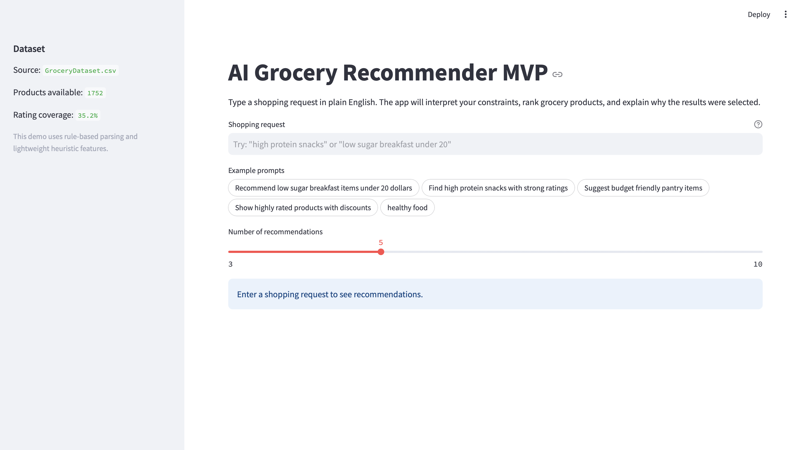
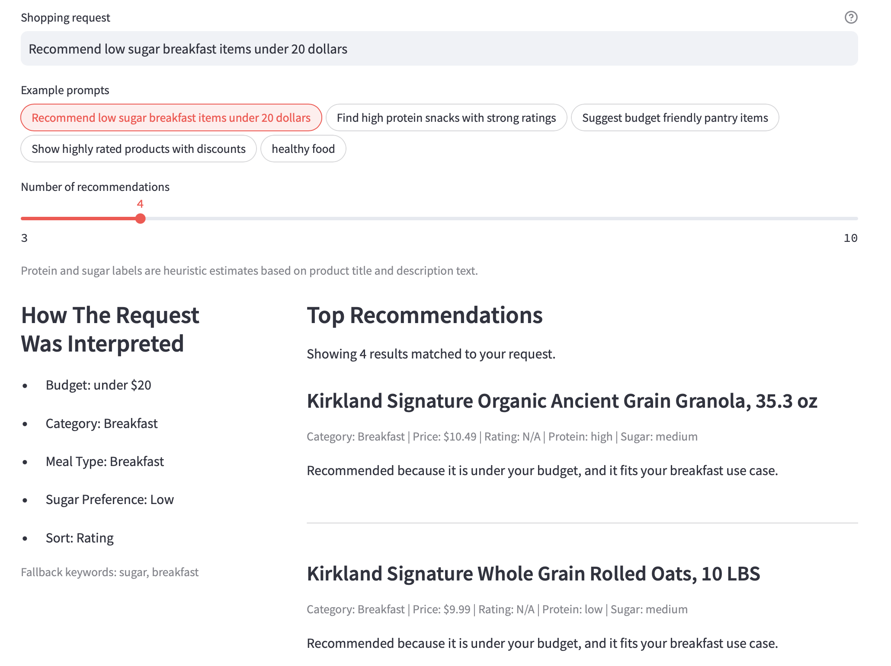
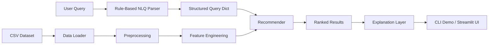
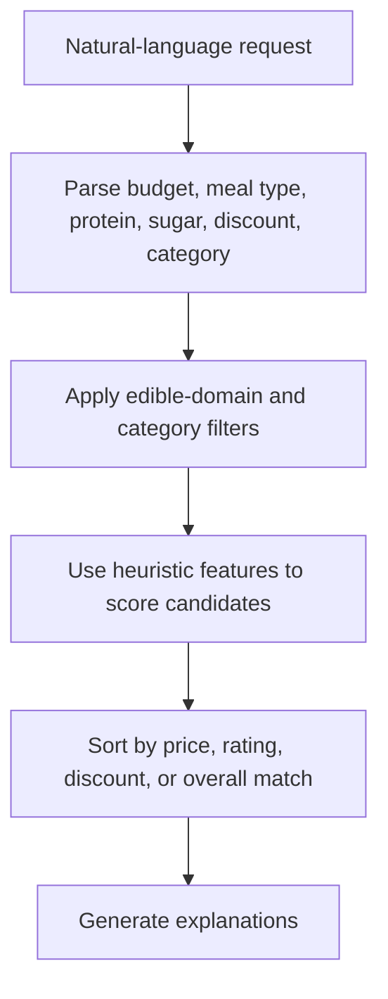

# AI Grocery Recommender MVP

An end-to-end applied AI prototype that turns natural-language shopping requests into structured filters, heuristic product features, ranked grocery recommendations, and short explanations.

This project is designed for fast product iteration and portfolio demos. It is intentionally lightweight, readable, and modular. It is not a production recommendation system.

## Overview

The system supports requests such as:

- `Recommend low sugar breakfast items under $20`
- `Find high protein snacks with strong ratings`
- `Suggest budget friendly pantry items`
- `Show highly rated products with discounts`
- `healthy food`

Under the hood, the app:

1. parses the user request into a structured query
2. cleans and standardizes grocery product data
3. builds heuristic product features from title and description text
4. filters and ranks candidate products
5. generates short, readable recommendation explanations

## Demo Preview

### Streamlit App



### Example Output



```text
User query: Find high protein snacks with strong ratings

G2G 3-pack Peanut Butter & Jelly Protein Bars, 24-count
Recommended because it has a strong rating, it is estimated as high protein from title and description keywords, and it fits your snack use case.
```

## Why This Project Matters

This project is a strong example of applied AI product engineering because it demonstrates:

- natural-language constraint extraction without external APIs
- transparent heuristic reasoning on imperfect datasets
- explainable ranking instead of opaque output
- graceful fallback behavior for ambiguous and unsupported queries
- an end-to-end product flow from input to recommendation UI

It is best positioned as a portfolio project for:

- Applied AI Engineer
- AI Product Engineer
- Founding Engineer / Prototype Engineer
- Full-stack AI Engineer
- Search / recommendation prototyping roles

## Architecture



### Request Lifecycle



## Key Features

- Automatic CSV detection in the current working folder
- Column normalization into `snake_case`
- Price, rating, and discount cleaning
- Heuristic nutrition-style proxies:
  - `estimated_protein_level`
  - `estimated_sugar_level`
  - `meal_type_tags`
  - `health_score`
- Rule-based natural-language parsing
- Category mapping and edible-only fallback handling
- Explanation generation for each recommendation
- Interactive Streamlit demo

## Repository Structure

```text
.
├── GroceryDataset.csv
├── app.py
├── demo_script.py
├── README.md
└── grocery_agent
    ├── __init__.py
    ├── data_loader.py
    ├── feature_engineering.py
    ├── nlq_parser.py
    ├── preprocess.py
    └── recommender.py
```

## Modules

### `grocery_agent/data_loader.py`

- auto-detects the most likely grocery CSV
- standardizes column names
- returns a pandas DataFrame

### `grocery_agent/preprocess.py`

- cleans core text fields
- parses prices like `"$14.99"` into floats
- extracts ratings from strings like `"Rated 4.3 out of 5 stars"`
- extracts numeric discount amounts
- removes exact duplicates

### `grocery_agent/feature_engineering.py`

Creates lightweight structured features such as:

- `category_normalized`
- `text_blob`
- `budget_flag`
- `discount_flag`
- `high_rating_flag`
- `estimated_protein_level`
- `estimated_sugar_level`
- `meal_type_tags`
- `health_score`

These are transparent heuristics built from title, feature text, and description text because the dataset does not include full nutrition facts.

### `grocery_agent/nlq_parser.py`

Extracts signals such as:

- budget / max price
- rating intent
- category and meal type
- protein intent
- sugar intent
- healthy intent
- discount intent
- edible-only flag
- fallback text terms

### `grocery_agent/recommender.py`

- applies safe filtering
- handles edible-domain gating
- performs simple scoring and ranking
- supports fallback text matching
- returns top results with short explanations

### `demo_script.py`

Runs a few representative queries end to end from the terminal.

### `app.py`

A Streamlit interface for interactive product demos.

## Example Structured Query

Input:

```text
high protein breakfast under 20 dollars
```

Output:

```python
{
    "max_price": 20.0,
    "subcategory": "breakfast",
    "protein_level": "high",
    "meal_type": "breakfast",
    "edible_only": True,
    "sort_by": "rating",
}
```

## Quick Start

### Requirements

- Python 3.10+
- pandas
- streamlit

### Install

```bash
pip install pandas streamlit
```

### Run the CLI demo

```bash
python demo_script.py
```

### Run the Streamlit app

```bash
streamlit run app.py
```

## Example Queries

Try these in the CLI demo or Streamlit app:

- `cheap snacks`
- `high protein breakfast`
- `low sugar drinks under 10`
- `healthy food`
- `highly rated products with discounts`

## Design Principles

### 1. Clarity over cleverness

The code is deliberately simple and easy to edit. The goal is prototype speed and explainability, not algorithmic sophistication.

### 2. Heuristics should be transparent

The project does not pretend to have exact nutritional truth. Protein and sugar labels are estimated from keywords and should be presented honestly.

### 3. Good demos handle bad input

The parser and recommender include fallback handling for weakly parsed, ambiguous, and unsupported queries so the product feels more trustworthy.

## Limitations

This is an MVP, so there are important constraints:

- protein and sugar estimates are heuristic, not authoritative
- the ranking model is rule-based, not learned from user behavior
- there is no personalization or session memory
- there is no backend service, auth layer, or monitoring
- there are no automated evals yet
- the dataset itself is imperfect for true nutrition-aware recommendation

## How To Position This Project

Best framing:

> an explainable AI recommendation prototype that converts natural-language shopping constraints into structured filtering and ranked results

Avoid overstating it as:

- a production-grade recommendation platform
- a large-scale retrieval system
- a nutrition-accurate dietary recommendation engine

## Roadmap Ideas

- add a stronger query planner
- add evaluation cases and expected outputs
- support embeddings or lexical retrieval improvements
- expose the recommender through a small backend API
- add richer explanation templates
- add saved example scenarios and benchmark queries

## Dataset Notes

The project expects a grocery-style CSV with columns similar to:

- `Sub Category`
- `Price`
- `Discount`
- `Rating`
- `Title`
- `Currency`
- `Feature`
- `Product Description`

If the filename is unknown, the loader searches the current folder and selects the most likely CSV automatically.

## Suggested Portfolio Summary

If you want to reference this project on a resume or portfolio:

> Built a modular Python MVP for an AI grocery recommendation assistant that translates natural-language shopping constraints into structured filters, heuristic product features, ranked results, and explanations via a Streamlit demo.
