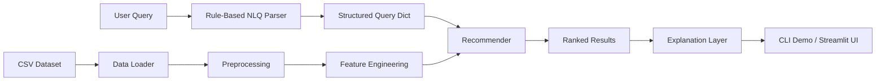
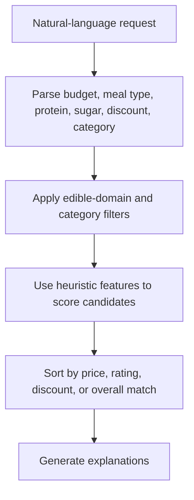

# AI Grocery Recommender MVP

[Live Demo](https://ai-grocery-recommender-mvp.streamlit.app/) | [GitHub Repo](https://github.com/Sophie-WZR/ai-grocery-recommender-mvp)

An end-to-end applied AI prototype that turns natural-language shopping requests into structured filters, heuristic product features, ranked grocery recommendations, and short explanations.

This project is designed for fast product iteration and portfolio demos. It is intentionally lightweight, readable, and modular. It is not a production recommendation system.

## Overview

The system supports requests such as:

- `Recommend low sugar breakfast items under $20`
- `Find high protein snacks with strong ratings`
- `Suggest budget friendly pantry items`
- `Show highly rated products with discounts`
- `healthy food`

Under the hood, the app:

1. parses the user request into a structured query
2. cleans and standardizes grocery product data
3. builds heuristic product features from title and description text
4. filters and ranks candidate products
5. generates short, readable recommendation explanations

## Demo Preview

### Streamlit App


### Example Output


## Why This Project Matters

This project is a strong example of applied AI product engineering because it demonstrates:

- natural-language constraint extraction without external APIs
- transparent heuristic reasoning on imperfect datasets
- explainable ranking instead of opaque output
- graceful fallback behavior for ambiguous and unsupported queries
- an end-to-end product flow from input to recommendation UI

It is best positioned as a portfolio project for:

- Applied AI Engineer
- AI Product Engineer
- Founding Engineer / Prototype Engineer
- Full-stack AI Engineer
- Search / recommendation prototyping roles

## Architecture



### Request Lifecycle



## Key Features

- Automatic CSV detection in the current working folder
- Column normalization into `snake_case`
- Price, rating, and discount cleaning
- Heuristic nutrition-style proxies:
  - `estimated_protein_level`
  - `estimated_sugar_level`
  - `meal_type_tags`
  - `health_score`
- Rule-based natural-language parsing
- Category mapping and edible-only fallback handling
- Explanation generation for each recommendation
- Interactive Streamlit demo

## Quick Start

### Requirements

- Python 3.10+
- pandas
- streamlit

### Install

```bash
pip install pandas streamlit
```

### Run the CLI demo

```bash
python demo_script.py
```

### Run the Streamlit app

```bash
streamlit run app.py
```

## Deploying The App

The interactive app is a Streamlit application, so it should be deployed to a service that can run Python, such as Streamlit Community Cloud.

Recommended setup:

1. Push this repository to GitHub
2. Go to Streamlit Community Cloud
3. Create a new app from this repo
4. Set the entrypoint to:

```text
app.py
```

The included `requirements.txt` is enough for this project:

```text
pandas
streamlit
```

## Limitations

This is an MVP, so there are important constraints:

- protein and sugar estimates are heuristic, not authoritative
- the ranking model is rule-based, not learned from user behavior
- there is no personalization or session memory
- there is no backend service, auth layer, or monitoring
- there are no automated evals yet
- the dataset itself is imperfect for true nutrition-aware recommendation

## Dataset Notes

The project expects a grocery-style CSV with columns similar to:

- `Sub Category`
- `Price`
- `Discount`
- `Rating`
- `Title`
- `Currency`
- `Feature`
- `Product Description`

If the filename is unknown, the loader searches the current folder and selects the most likely CSV automatically.
